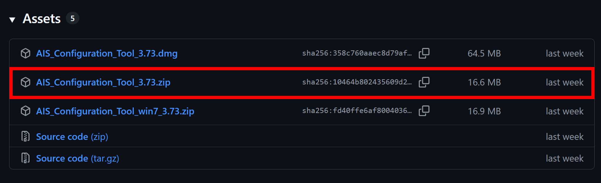
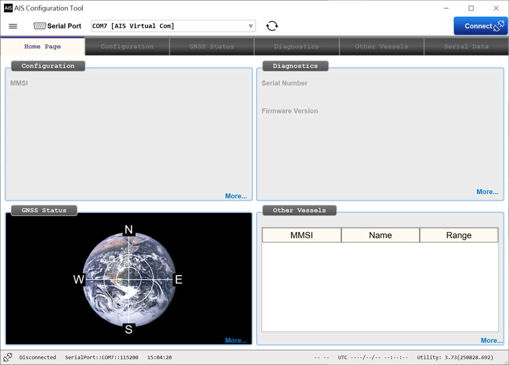
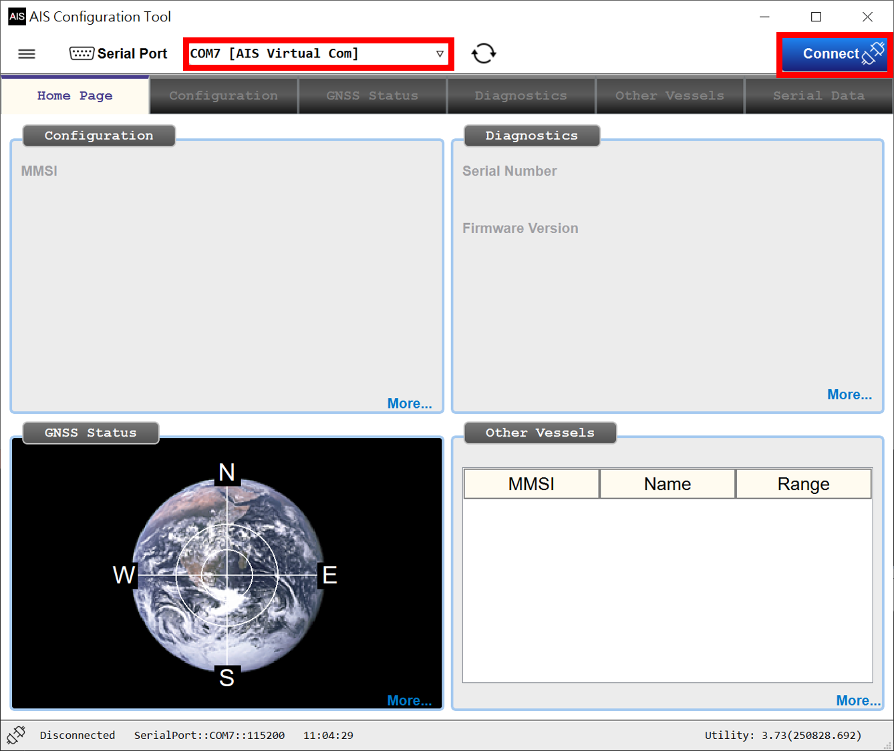
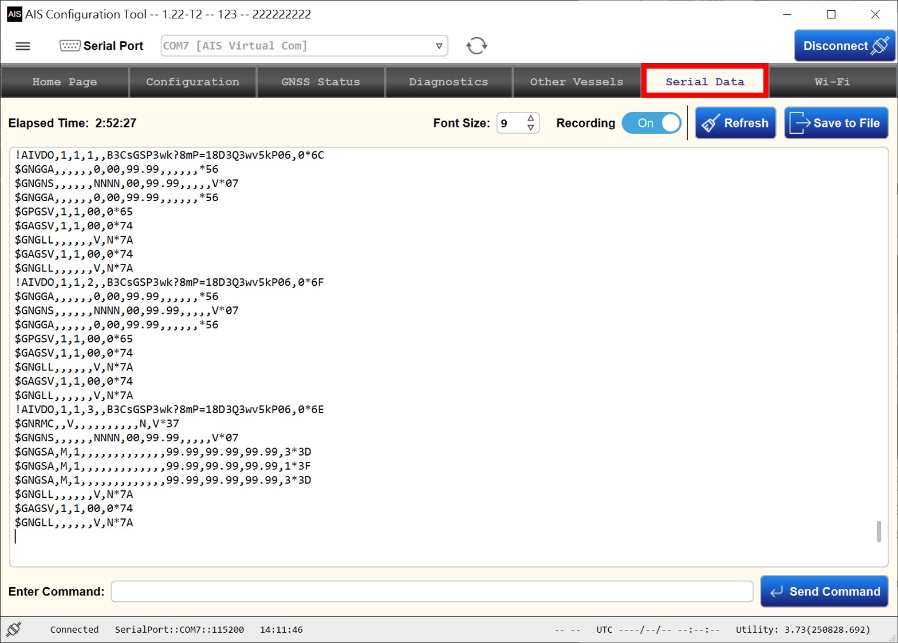
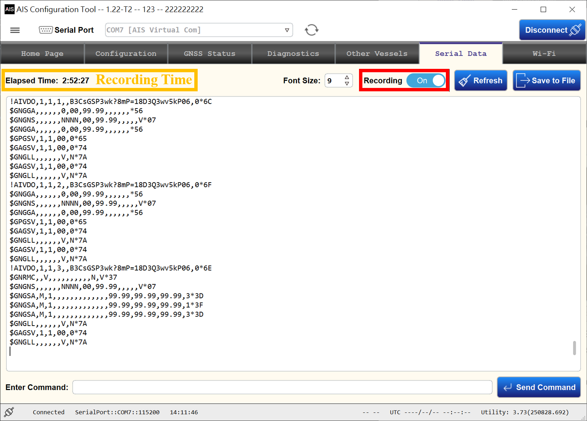
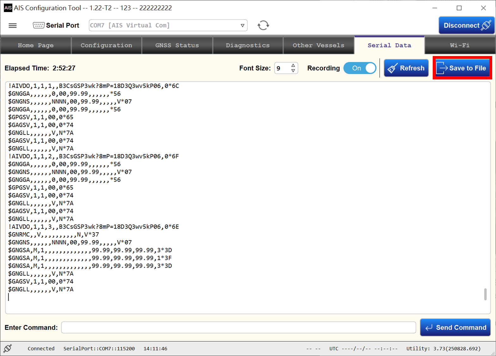
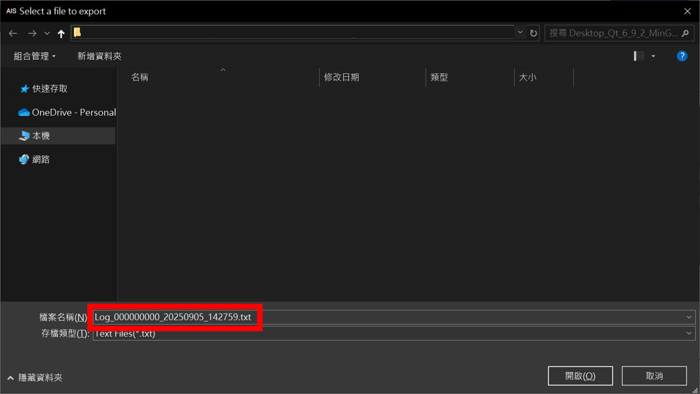

# Record Log File

## Environment Setting

- Connect the power supply to 12/24 VDC.
- Connect the GPS antenna, and ensure it has a clear view of the sky.
- Connect the VHF antenna.
- Connect the cable between the computer and the AIS device.
- Download and install the **AIS Configuration Tool** software on the computer.

## Download AIS Configuration Tool

- Go to the website: https://github.com/leslieyang-amec/xAisUtility/releases.
 
- Download the zip file and extract it.
- Run **AIS_Configuration_Tool.bat**.
 

## Choose the related serial port, and click the "Connect" button

## Turn to the Serial Data Page

## Check recording time and "Recording" is switched to on

## Click the "Save to File" button

## The default filename is "Log_MMSI_Date_Time.txt"

