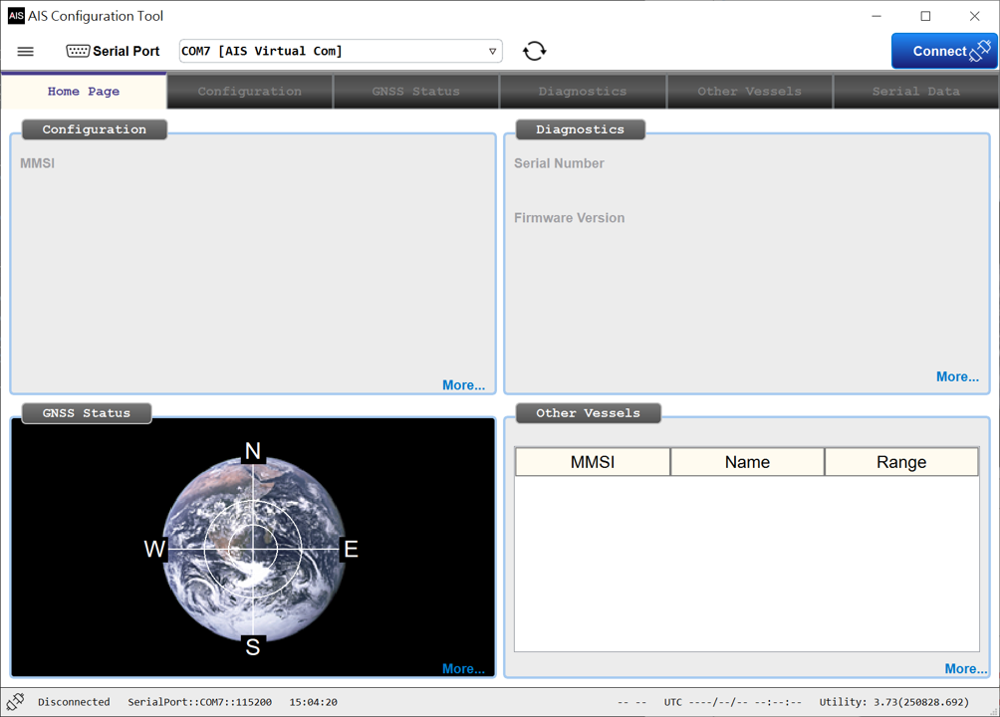
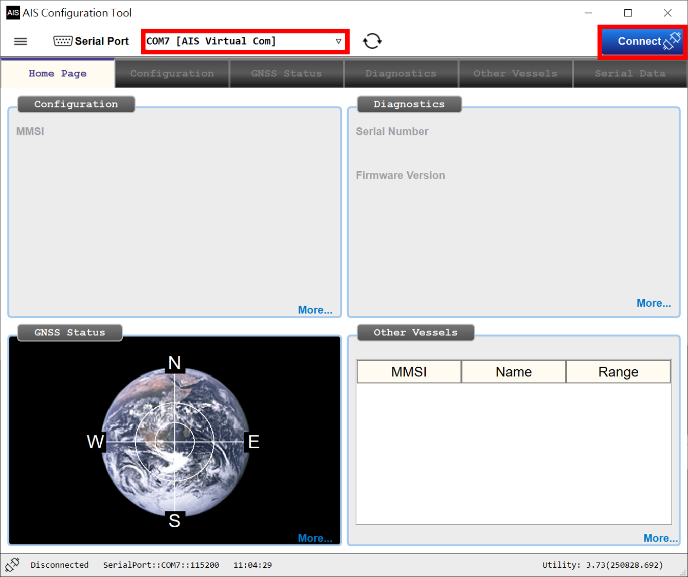
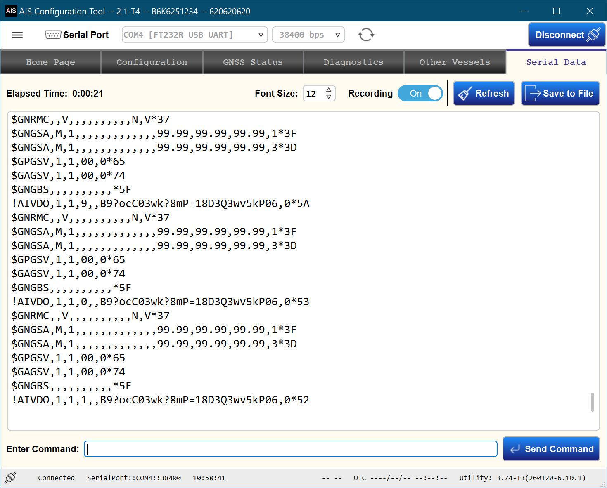
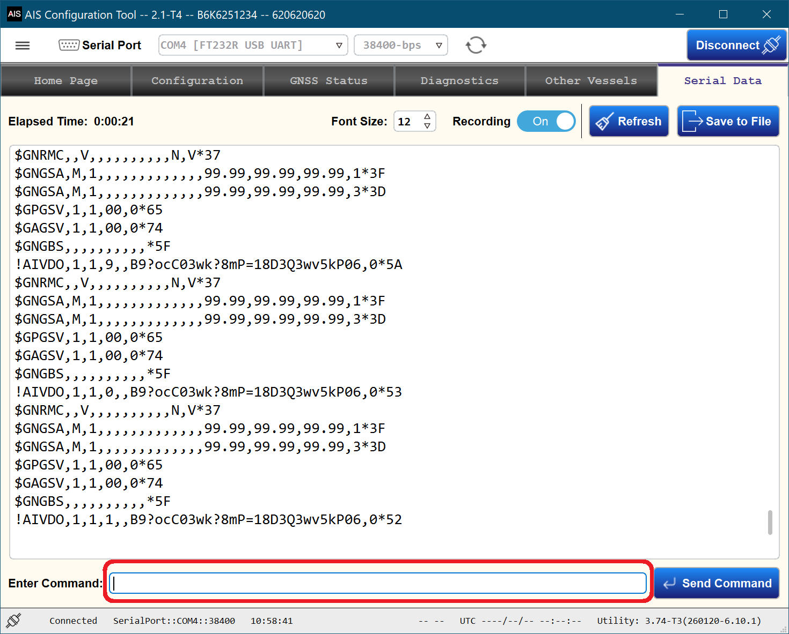
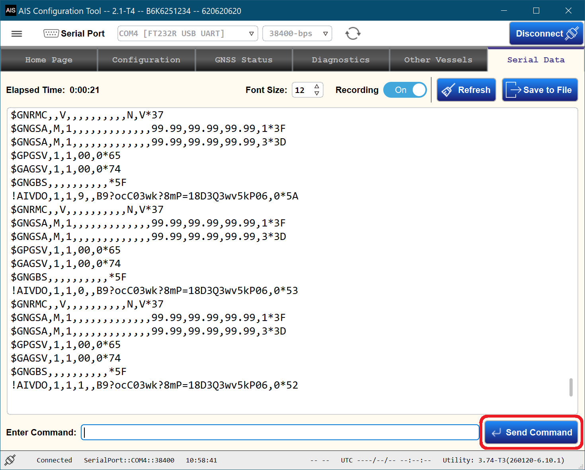

# Send Command

## Environment Setting

- Connect the AIS device to the power supply of 12/24 VDC.
- Connect the USB cable between the computer and the AIS device.
- Download the **AIS Configuration Tool** software on the computer.

## command via AIS Configuration Tool

### Run `AIS_Configuration_Tool.bat`.
 

### Choose the related serial port, and click the `Connect` button.

### Turn to the `Serial Data` Page.

### Page command under the `Enter Command:` blank, then press `Send Command` button.

### Press `Send Command` button.

